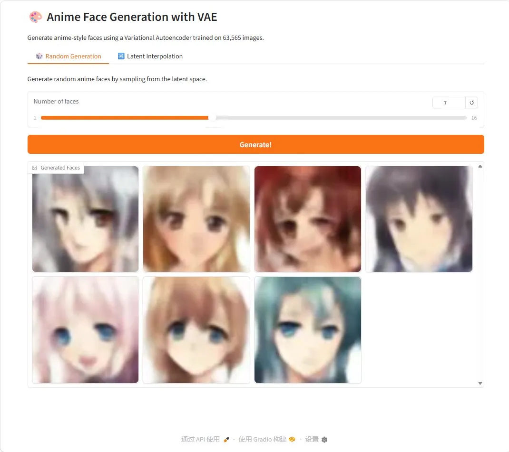

# Anime Face Generation with a Variational Autoencoder

This project implements a **Variational Autoencoder (VAE)** from scratch to generate anime-style face images. The goal is to learn the underlying distribution of anime face images and produce new samples that resemble the training data.

---

## 1. Image Source

This project uses the [Anime Face Dataset](https://www.kaggle.com/datasets/splcher/animefacedataset) from Kaggle, which contains **63,565 aligned anime-style face images**. The dataset is well-suited for generative modeling due to its consistency in face alignment and image quality.

---

## 2. Model Architecture

A **Variational Autoencoder (VAE)** was implemented from scratch using PyTorch, without any pre-trained models or fine-tuning.

**Encoder:** 4 convolutional layers (64→32→16→8→4) that map input images to a latent distribution (mean `μ` and log-variance `logvar`)

**Decoder:** 4 transposed convolutional layers that reconstruct images from sampled latent vectors

**Training Objective:**
- **Reconstruction loss** (Binary Cross-Entropy) — ensures generated images resemble the input
- **KL divergence loss** — regularizes the latent space toward a standard normal distribution

$$\mathcal{L} = \mathcal{L}_{recon} + \beta \cdot \mathcal{L}_{KL}$$

---

## 3. Extra Criteria

### ✅ ML Operations — Metrics Tracking (wandb)
Training metrics were tracked using **Weights & Biases (wandb)**, including loss, reconstruction loss, and KL divergence logged at every epoch, along with generated image samples.

📊 [View all training runs on W&B](https://wandb.ai/shi1gesong-northwestern-university/anime-vae)

### Hyperparameter Tuning
5 experiments were conducted to analyze the impact of different hyperparameters on generation quality:

| Run | latent_dim | beta | lr | epochs | Observation |
|-----|-----------|------|----|--------|-------------|
| elated-spaceship-1 | 128 | 1.0 | 1e-3 | 50 | ✅ Stable baseline |
| amber-river-2 | 128 | 1.0 | 1e-3 | 100 | ✅ Better convergence |
| feasible-blaze-3 | 128 | 0.5 | 1e-3 | 50 | ❌ More diverse but less structured |
| mild-grass-4 | 128 | 1.0 | 5e-4 | 50 | ❌ Slower convergence, slightly blurrier |
| wise-puddle-5 | 64 | 1.0 | 1e-3 | 50 | ❌ Over-compressed, more blurry |

**Key findings:**
- **beta=1.0** produces the most stable and coherent results; lowering beta (0.5) loosens KL regularization, increasing diversity but reducing quality
- **lr=1e-3** converges faster and produces sharper results than lr=5e-4
- **latent_dim=128** outperforms latent_dim=64, which over-compresses the latent space and loses detail
- **100 epochs** yields slightly better convergence than 50 epochs, confirming the model benefits from longer training

### Latent Space Exploration
Interpolation between two random latent vectors to visualize smooth transitions in the generated image space:


### Gallery GUI (Gradio)
An interactive web interface built with **Gradio** that allows users to:
- Generate random anime faces by sampling from the latent space
- Visualize smooth latent space interpolation between two faces



Run with:
```bash
python app.py
```

---
## 4. Results

### Generated Faces — Epoch 50 (Default: latent_dim=128, beta=1.0)


### Generated Faces — Epoch 100


### Latent Space Interpolation


> Note: VAEs are known to produce slightly blurry outputs due to the pixel-level reconstruction loss. This is a fundamental limitation of the VAE framework, not a training issue. Future work could explore GANs or Diffusion Models for sharper results.

---

## 5. How to Run

### Install dependencies
```bash
pip install -r requirements.txt
```

### Train the model
```bash
python train_vae.py --data_dir data\anime --epochs 100 --batch_size 128 --latent_dim 128
```

### Launch the Gallery GUI
```bash
python app.py
```

### Key training arguments
| Argument | Default | Description |
|----------|---------|-------------|
| `--data_dir` | `data` | Path to image folder |
| `--epochs` | 50 | Number of training epochs |
| `--batch_size` | 128 | Batch size |
| `--latent_dim` | 128 | Latent space dimensions |
| `--lr` | 1e-3 | Learning rate |
| `--beta` | 1.0 | KL loss weight |

---

## 6. Tech Stack
- Python
- PyTorch
- torchvision
- NumPy
- Matplotlib
- Pillow
- Weights & Biases (wandb)
- Gradio

---

## 7. Future Improvements
- Add a deeper convolutional VAE architecture with BatchNorm
- Compare results with GAN or Diffusion Models
- Implement distributed training pipelines
