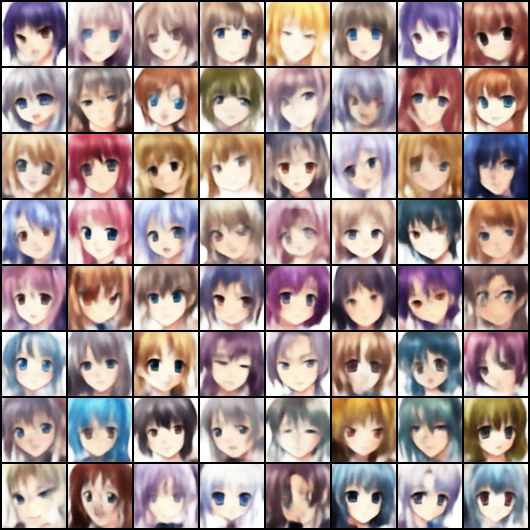
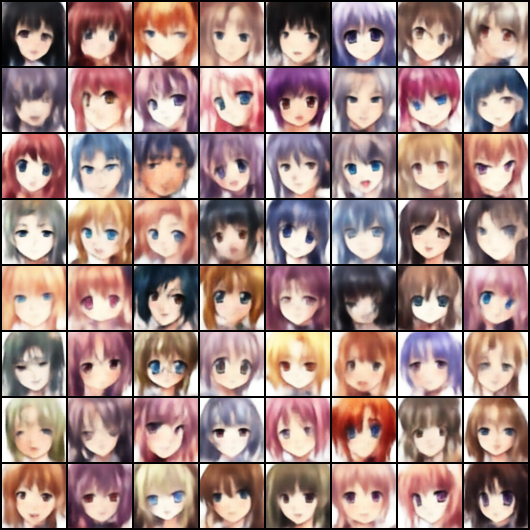

# Anime Face Generation with a Variational Autoencoder

This project implements a **Variational Autoencoder (VAE)** from scratch to generate anime-style face images. The goal is to learn the underlying distribution of anime face images and produce new samples that resemble the training data.

---

## 1. Image Source

This project uses the [Anime Face Dataset](https://www.kaggle.com/datasets/splcher/animefacedataset) from Kaggle, which contains **63,565 aligned anime-style face images**. The dataset is well-suited for generative modeling due to its consistency in face alignment and image quality.

---

## 2. Model Architecture

A **Variational Autoencoder (VAE)** was implemented from scratch using PyTorch, without any pre-trained models or fine-tuning.

**Encoder:** 4 convolutional layers (64→32→16→8→4) that map input images to a latent distribution (mean `μ` and log-variance `logvar`)

**Decoder:** 4 transposed convolutional layers that reconstruct images from sampled latent vectors

**Training Objective:**
- **Reconstruction loss** (Binary Cross-Entropy) — ensures generated images resemble the input
- **KL divergence loss** — regularizes the latent space toward a standard normal distribution

$$\mathcal{L} = \mathcal{L}_{recon} + \beta \cdot \mathcal{L}_{KL}$$

---

## 3. Extra Criteria

### ✅ Latent Space Exploration
Interpolation between two random latent vectors to visualize smooth transitions in the generated image space:


### ✅ Hyperparameter Tuning
Tested the following configurations and compared their impact on generation quality:

| Config | latent_dim | beta | epochs | Observation |
|--------|-----------|------|--------|-------------|
| Default | 128 | 1.0 | 50 | Consistent, stable results |
| Tuned | 256 | 0.5 | 50 | More diverse but less structured |

Key finding: A higher beta value enforces stronger regularization on the latent space, producing more consistent outputs. Reducing beta allows more expressive generation but can reduce coherence.

### ✅ Training Visualization
Generated samples were saved at every epoch to track visual progress throughout training.

---

## 4. Results

### Generated Faces — Epoch 50 (Default: latent_dim=128, beta=1.0)


### Generated Faces — Epoch 100


### Latent Space Interpolation


> Note: VAEs are known to produce slightly blurry outputs due to the pixel-level reconstruction loss. This is a fundamental limitation of the VAE framework, not a training issue. Future work could explore GANs or Diffusion Models for sharper results.

---

## 5. How to Run

### Install dependencies
```bash
pip install -r requirements.txt
```

### Train the model
```bash
python train_vae.py --data_dir data\anime --epochs 50 --batch_size 128 --latent_dim 128
```

### Key arguments
| Argument | Default | Description |
|----------|---------|-------------|
| `--data_dir` | `data` | Path to image folder |
| `--epochs` | 50 | Number of training epochs |
| `--batch_size` | 128 | Batch size |
| `--latent_dim` | 128 | Latent space dimensions |
| `--lr` | 1e-3 | Learning rate |
| `--beta` | 1.0 | KL loss weight |

---

## 6. Tech Stack
- Python
- PyTorch
- torchvision
- NumPy
- Matplotlib
- Pillow

---

## 7. Future Improvements
- Add a deeper convolutional VAE architecture with BatchNorm
- Compare results with GAN or Diffusion Models
- Build an interactive Gradio interface for face generation
- Integrate Weights & Biases (wandb) for experiment tracking
